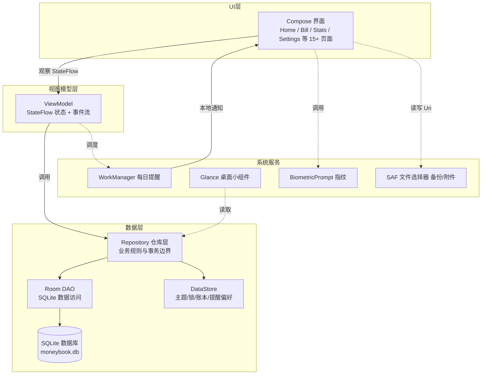
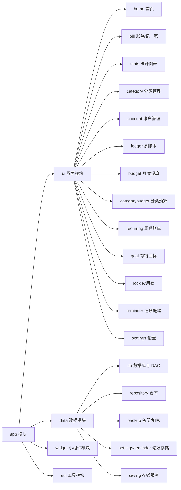
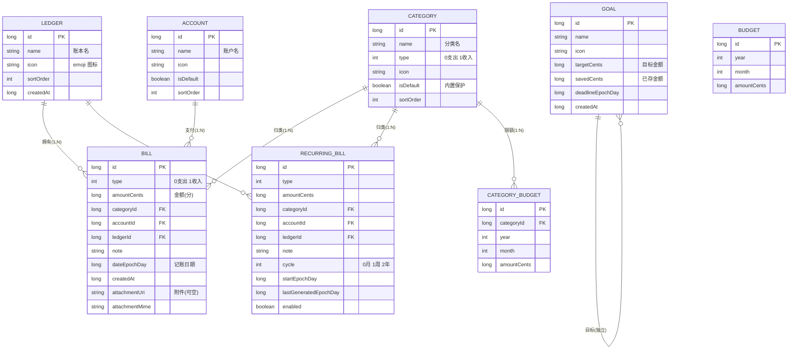

# 记账本（MoneyBook）系统总体设计

> 文档版本：v1.0 ｜ 对应软件版本：MoneyBook v1.4.0

## 1. 总体架构

系统采用 **MVVM + Repository 分层架构**，基于 Android 官方推荐的应用架构：

**分层职责**：
- **UI 层**：Jetpack Compose 声明式界面，只观察 ViewModel 状态并回传用户意图；
- **ViewModel 层**：持有 UI 状态（StateFlow），组合多个数据流（combine/flatMapLatest），处理业务事件；
- **Repository 层**：封装数据来源（Room、DataStore）、事务边界（withTransaction）、业务规则（如删除账户转移账单、周期账单生成）；
- **数据层**：Room 提供响应式 Flow 查询；DataStore 持久化轻量偏好。

## 2. 模块划分

## 3. 数据库设计（E-R 图）

数据库版本 v4，共 8 张表：

**关键设计**：
- 金额一律以「分」（Long）存储，杜绝浮点误差；
- 日期以 `epochDay`（自 1970-01-01 的天数）存储，按区间查询汇总；
- 账单 → 分类/账户/账本为外键约束（RESTRICT），删除分类/账户/账本时由仓库层事务显式转移或级联清理；
- 数据库 1→2→3→4 共三次版本迁移，每次迁移均通过真实 SQLite 引擎的自动化测试验证（17+8 项断言全通过）。

## 4. 关键业务流程

### 4.1 周期账单自动补记
App 启动 → `RecurringRepository.generateDue()` → 遍历启用中的周期账单 → 从 `lastGeneratedEpochDay` 按周期推算下一生成日（月末/闰年自动收敛）→ 逐笔插入账单并推进游标 → 全部在同一事务内完成，防重复、防部分写入。

### 4.2 加密备份
导出：全量数据 → JSON 序列化 → GZIP 压缩 → AES-256-GCM 加密（密钥由应用锁 PIN 经 SHA-256 派生）→ 写入 `.mbk` 文件。
导入：读取文件头识别格式（`.mbk` 加密包自动解密解压 / 旧版 `.json` 直接解析）→ 校验引用完整性 → 事务内整体覆盖恢复。

### 4.3 账本隔离
所有账单查询（首页汇总、列表、统计、小组件）均携带当前活动账本 id；活动账本由 DataStore 持久化，切换后各页面 Flow 自动重查。
