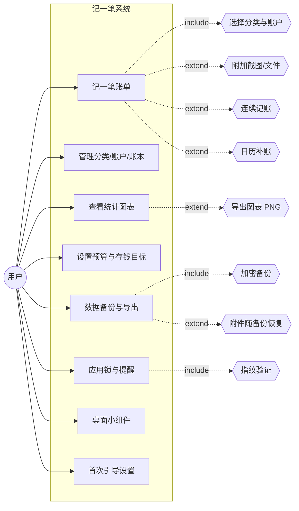
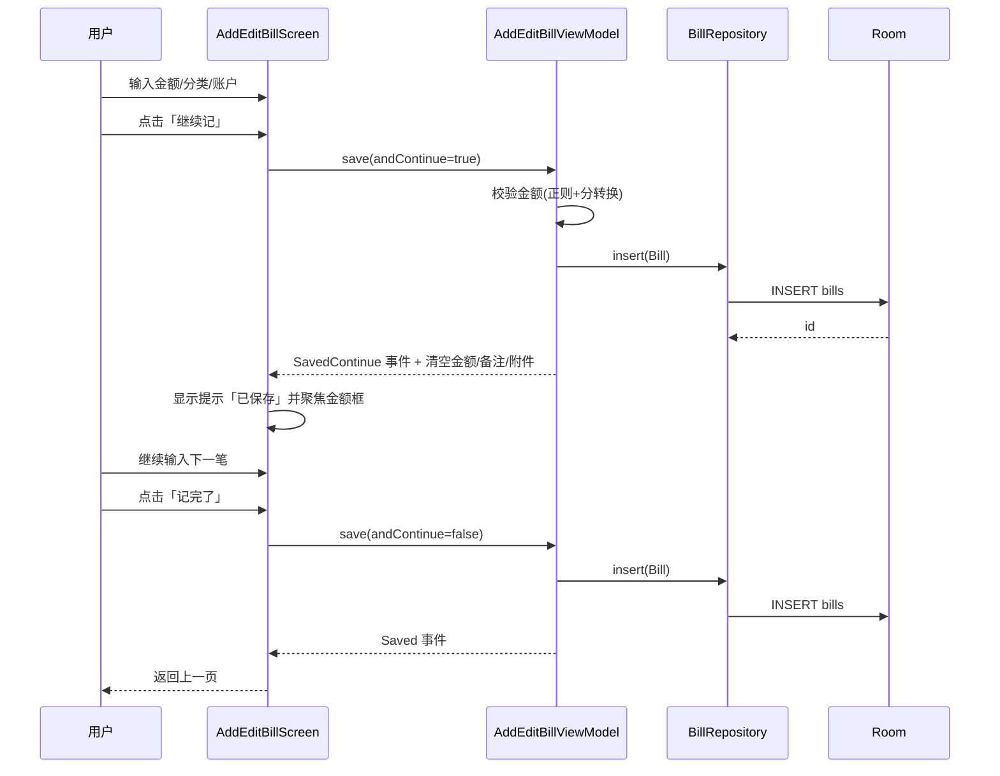
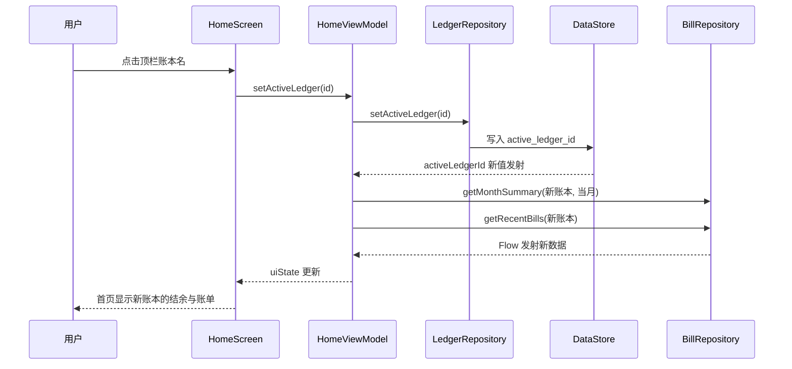
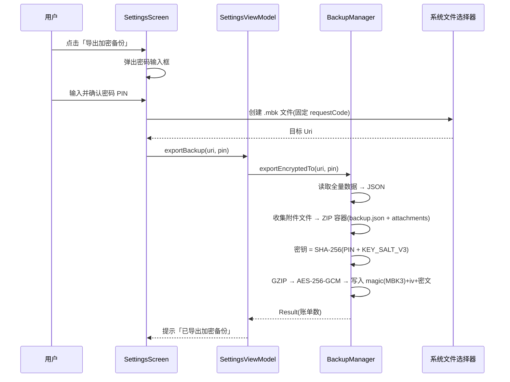
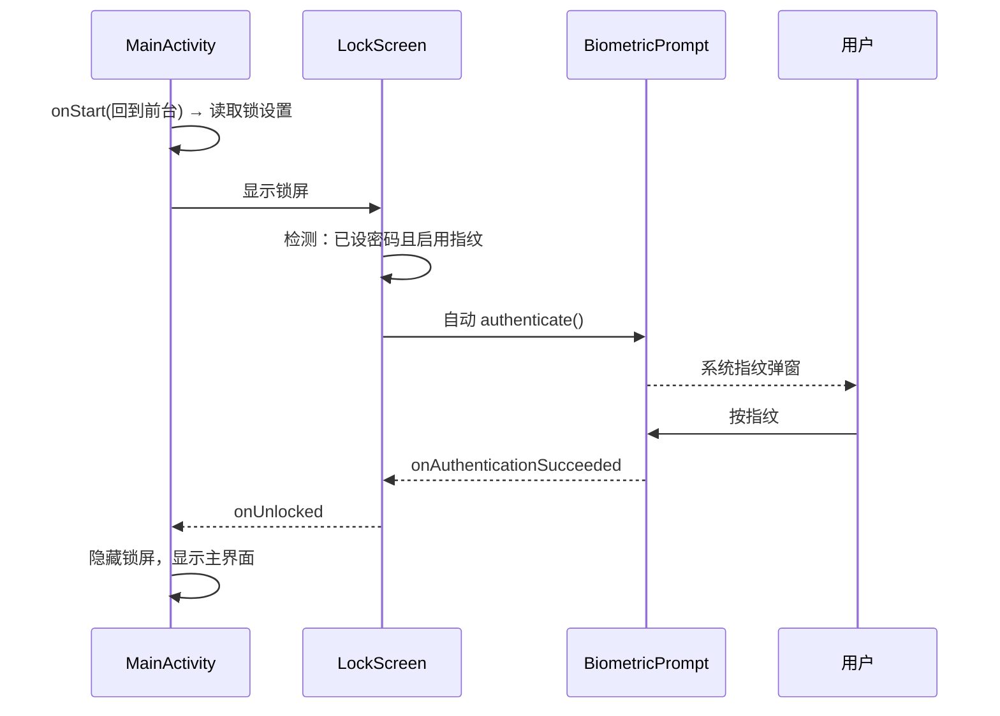
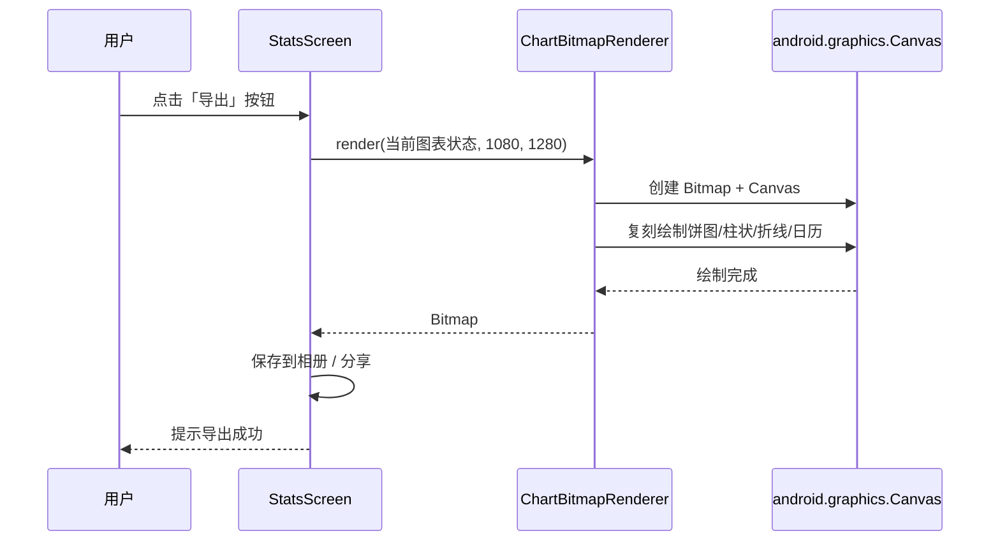
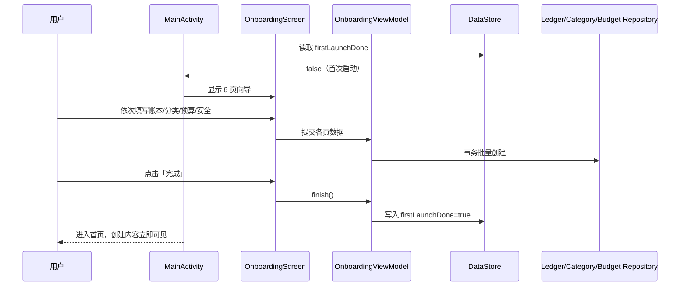

# 记一笔（MoneyBook）UML 建模

> 文档版本：v1.1 ｜ 对应软件版本：记一笔 v2.0.0（正式版） ｜ 更新日期：2026-08-15
> 图表使用 Mermaid 绘制（GitHub 原生渲染）。

## 1. 用例图

### 1.1 总体用例

### 1.2 核心用例「记一笔」详细用例

| 项 | 内容 |
| --- | --- |
| 用例名称 | 记一笔账单 |
| 参与者 | 用户 |
| 前置条件 | 已进入首页（或从日历视图点日期进入） |
| 基本流 | 1. 点击悬浮「+」按钮；2. 选择支出/收入；3. 输入金额；4. 选择分类（自动选中第一个）；5. 选择账户；6. 填写备注（可选）；7. 选择日期（默认今天）；8. 可选附加截图/文件；9. 点击「记完了」保存并返回 |
| 扩展流 | 3a. 金额为空/非法 → 提示错误不保存；9a. 点击「继续记」→ 保存后留在本页并自动聚焦金额框、清空附件；9b. 附加了图片 → 列表显示附件图标；10. 从日历图进入时日期自动带入所选日期 |
| 后置条件 | 账单写入数据库，首页/统计/小组件自动刷新 |

## 2. 时序图

### 2.1 记一笔（含连续记账）

### 2.2 切换账本（多账本联动）

### 2.3 加密备份导出（v3，跨设备可恢复）

### 2.4 指纹解锁（自动唤起）

### 2.5 图表导出 PNG（原生 Canvas 渲染）

### 2.6 首次引导（创建即见）

